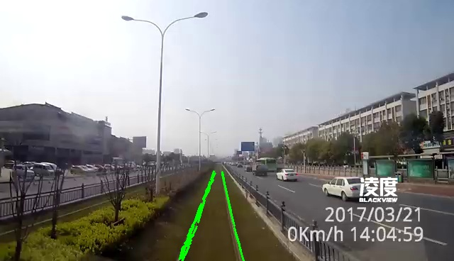
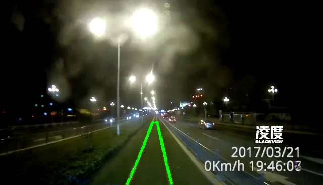
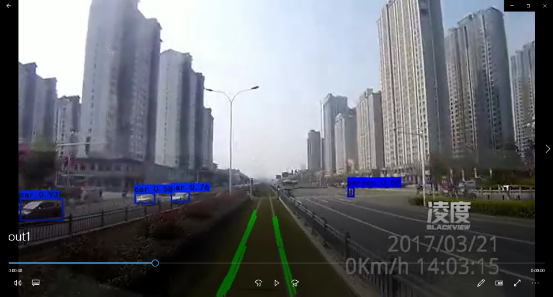
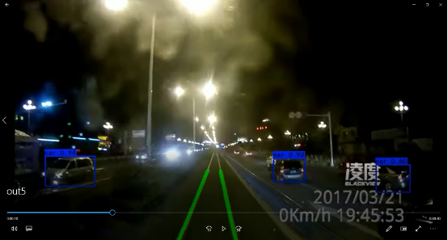

# Sample-Lane-Detection
A sample Lane detection using Digital image processing

## Introduction

code\VideoImageExtract：从视频中取出图片，100取1

code\PointPosition：鼠标取点

code\LaneLine1：1.1：Sobel阈值分割

code\LaneLine2：1.2：RGB阈值分割

code\LaneLine3：2.1：RGB阈值分割+三角区域

code\LaneLine4：2.2：Sobel阈值分割+梯形区域

code\LaneLine5：3.1：Sobel阈值分割+梯形区域+Hough变换

code\OutputVideo：将处理结果输出为视频

yolo3-pytorch.zip：找到的一个yolo3检测代码，修改了predict函数进行处理

## Result

白天：  

黑夜：  

白天行人车辆检测：  

黑夜行人车辆检测：  

